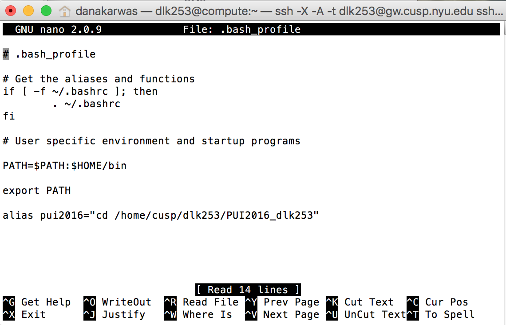
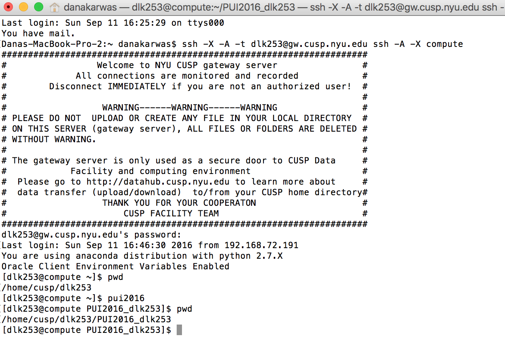

##My Contribution to this Assignment
For this assignment I worked alone. I tried to reach out to classmates in the NYU CLasses forum and posted a message, but did not get any responses. I was able to complete the merge but will still need to complete the fork. 

##Creating the HW1_dlk253 directory from Assignment 2 part 7:

For this I was having problems adding a directory, and kept on getting errors. It occured to me that I may try to add a file that was in the directory. When I added a sample.txt file inside the hw1_dlk253 directory the commit worked and I recieved no errors. Is there a way to add a directory through bash to the repository on git? Or can it only be files. I would like to learn more about this.

##adding images 
I ran into trouble uploading the pics through the terminal so they are uploaded through the git interface so you could see my process for Assignment 2, but I need to visit office hours to fully understand the git init and the git url commands.

##bash

##compute

