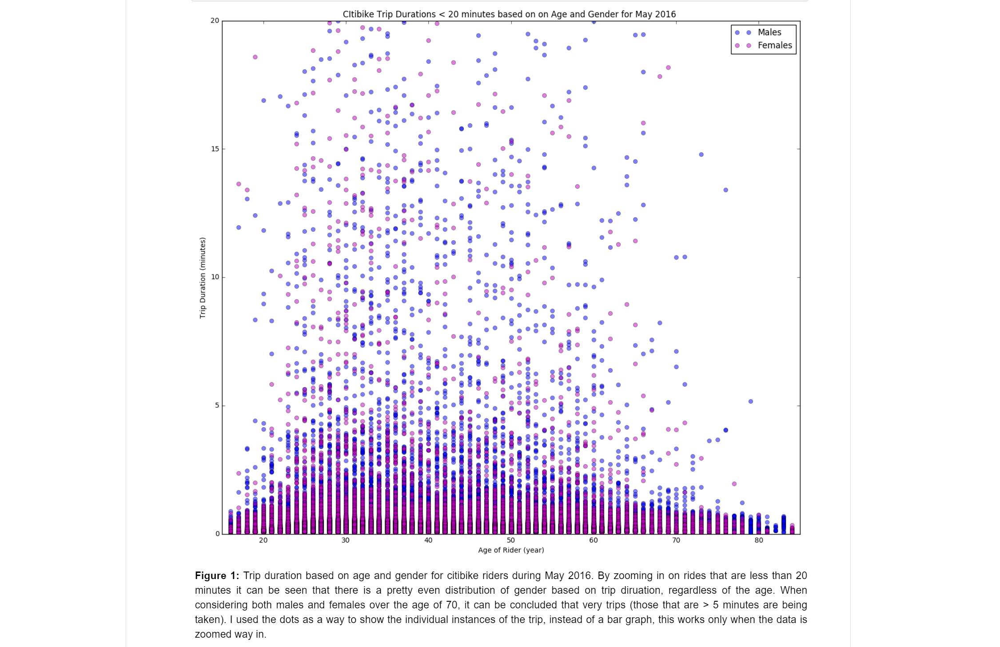

###  Hey Dana,

Your graph is pretty good. The infomation you try to convey through your plot is however not very clear. I would like to highlight that 
the overlapping of your data points of female and male category which makes your graph difficult to interpret. 
In the caption you've mentioned that we need to zoom in to the plot, this might be possible in an interactive plot but since we are on the jupyter notebook.I would recommend to make a static graph which is easily interpretable just by looking at it.

Also since the plot is huge, i would like to say that the size could have been smaller in order to visualise it without scrolling down. That way, interpreation would be easy.

-- Also it would be great to see the title of plot in bigger fontsize. 

Overall your graph is aesthetically good with a meaningful caption.

Good work done!

