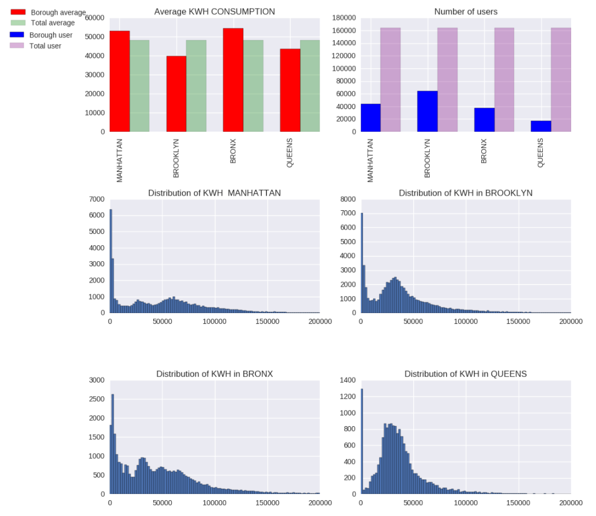

##Plot peer review by dlk253 for nm2762
Principles of Urban informatics HW8

This plot has the basic elements such as clearly labeled axis, a legend, a title, rendered colors, and description. 

Suggested improvements would include 

1.) For the plots it would be very helpful to have a description of the figures. This could be something like Figure 1. blah blah. Without a description of the plots it is hard to know what is going on. The description will also reinforce what was plotted.

2.) The x and y axis on each plot are missing labels. It would be helpful it it said (borough or users, etc.)

3.) Each plot is missing units, anytime there are numbers listed please clarify what units.

4.) The plots are pretty small and require some squinting. You may want to condiser putting them in one column instead of side by side.

5.) The numbers on the x and y axis for the plots take up a bunch of space. You may want to consider making an abbreviation. 

6.) The light grey grid looks nice, but maybe try withou the grid it might look more clean

7.) Try to put some more space between the title of each plot and the plot itself, also try making the title bold.

8.) It is hard to read the text when it is vertical, that is not natural. Maybe try to angle the text for the boroughs or us BK, Q, etc.

Good luck and I hope to see some improvements on this. 
This is the beginning of a really strong analysis.
I had fun reviewing this because you gave me something good to start with. 
Also you might enjoy this website: 
http://www.informationisbeautiful.net/

